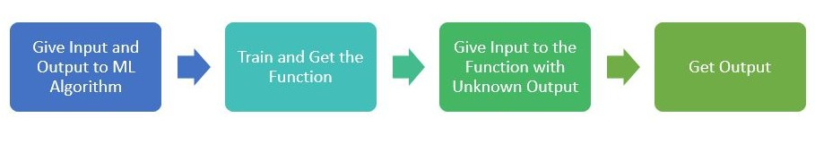
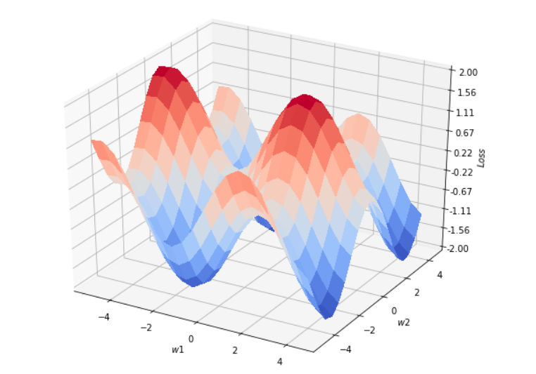
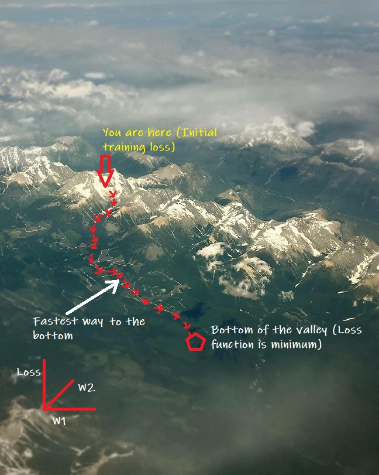

---
title: Machine Learning for absolute beginners
tags:
- Machine Learning
- Gradient Descent
desc: Basic Machine Learning
layout: post
--- 

Ever wondered how kids learn as they grow? They continuously learn from their experiences. For example, they learn to distinguish between a cat and a dog after they see many cats and dogs. Similarly, we can teach computers to learn from experiences, which are data. Traditionally, computers followed a set of instructions called programs to do a task. However, this approach is not effective in complex tasks such as image recognition and product recommendation, due to complex rules to write the function. In machine learning, we give computers input and output data and train them to figure out the best program by themselves to perform tasks without explicitly coding. This enables computers to do complex tasks which are not possible by conventional programming methods.

$$Traditional\: Programing\: Approach$$  
 
 

$$Machine\: Learning\: Approach$$
 

More formally, machine learning is the process of training computers to learn from data to do tasks without explicitly programming. Training is the process by which computers learn from the data and training data are the data used for training computers. Voice recognition, image recognition, and movie recommendation are all examples of machine learning tasks. 

Consider an image recognition machine learning model. The task of a machine learning model here is to correctly classify given images into one of the many categories. Machine learning models achieve this by learning from the training data. The training data consist of many images labeled as per their correct category. We assume that there exists a function that can accurately map given input images to their respective output labels. Machine learning lets the algorithm approximate this function from the data. We start the training by approximating a generalized expression of the function with many tunable parameters. For example, we can write a simple linear approximation of an image recognition algorithm as follows,

$W_1X_1 + W_2X_2 + W_3X_3 + ......+ W_nX_n= 1 $ if image is from category 1, $0$ otherwise

Here, $X_1$, $X_2$, $X_3$ ... $X_n$ are called the features of the data. Features are the values extracted from the input data on which we can do mathematical operations. A simple set of features for the above image recognition task would be the pixel values of the image.
$W_1$, $W_2$, ... $W_n$ are called the parameters or the weights of the machine learning model. If we change the parameters, we get different functions. In fact, there are infinite functions possible from the above general expression. Training the machine learning model means tuning these parameters such that the final equation represents the best possible form of the above expression that accurately maps the input to their respective output. If we consider input images of size (320px, 320px, 3), there are 307200 parameters to tune while training. The above linear model is very simplified and less effective in image recognition tasks. More complex expressions would perform better and would have millions of parameters to tune.

So far, we learned that training a machine model is actually finding the best values of the parameters so that it accurately predicts the output. We begin the training with randomly initialized parameters. Then the algorithm uses this random model to make predictions on all the images in the training dataset. The performance will be poor as the model is not tuned. Algorithm then evaluates the total error in prediction on the entire training images. This error is called the training loss. Our goal is to reduce training loss by changing the parameters, $W_1$, $W_2$,... $W_n$. We achieve this by a process called optimization. If we have only two parameters, $W_1$ and $W_2$, we can visualize the plot of loss, which is a function of the two parameters, as shown below. The goal of machine learning model is to find the values of the parameters $W_1$ and $W_2$ so that the loss is the minimum. So, we can imagine as if we need to maneuver a valley spanned by the parameters and to reach the bottom, which has the lowest loss. If we extend this to $n$ number of parameters, we are looking at finding the smallest value of loss function in an $n$ dimensional hyperplane spanned by the $n$ parameters. Remember, $n$  could be in millions for complex tasks such as image recognition using advanced machine learning algorithms.

$$Example\: of\: a\: 2D\: hyperplane$$  
 

Interestingly, the analogy of maneuvering a valley does come to our rescue in finding the least value of the loss function as well. Imagine yourself lost on top of a mountain with visibility restricted to a few meters. How would you find your fastest way down the mountain? With no further information available, one logical thing to do would be to look around and move along the direction of the greatest slope.  We can use a similar strategy to find the smallest value of a loss function. The algorithm finds the slope of the loss function $L$ with respect to the parameters and takes a small step along the steepest descent by adjusting the parameters as shown below.

$$W_i = W_i - \alpha \times \frac {\partial L}{\partial W_i} \tag{1}$$

$$Finding\: the\: Minimum\: Loss\: Function$$ 
$$(The\: mountain\: range\: is\: the\: Canadian\: Rockies\:, as\: viewed\: from\: an\: airplane\: from\: Calgary\: to\: Victoria)$$  
 

The algorithm then uses new parameters to make predictions on all the images in the training dataset. It then calculates the new training loss. Then it finds the direction of the steepest descent from the new location and updates the parameters by taking the next small step. The algorithm repeats this process until the derivative is zero. At this point, the loss function will have the minimum value and the error in prediction will be the minimum. This process of tuning the parameters is called the gradient descent Algorithm. $\alpha$ in equation 1 is the learning rate, which determines the size of step in each iteration. We train all machine learning algorithms using either the gradient descent algorithm or a variation of the gradient descent algorithm.

To summarize, machine learning models are functions that can predict output from a given input. The functions have many tunable parameters. Machine learning models adjust these parameters iteratively during training by minimizing the total error in predictions. The trained models are then used to make predictions on data which are not used to train the model.
